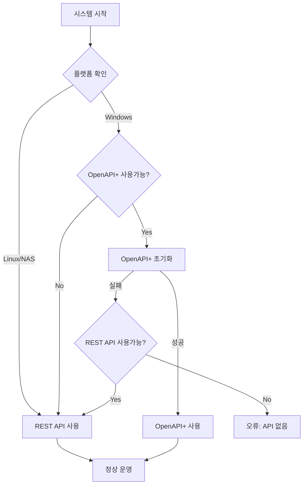

# 🏗️ 키움증권 하이브리드 자동매매 시스템 아키텍처

## 📋 목차
1. [개요](#개요)
2. [시스템 구성](#시스템-구성)
3. [API 선택 로직](#api-선택-로직)
4. [환경별 실행 방법](#환경별-실행-방법)
5. [API 전환 기능](#api-전환-기능)
6. [모니터링 및 관리](#모니터링-및-관리)

---

## 🎯 개요

OpenAPI+와 REST API를 모두 지원하는 하이브리드 자동매매 시스템으로, 환경에 따라 최적의 API를 자동 선택합니다.

### 주요 특징
- **Windows**: OpenAPI+ 우선 사용 (실시간 데이터, 빠른 응답)
- **Linux/NAS**: REST API 사용 (크로스플랫폼, 24/7 운영)
- **자동 전환**: API 실패시 자동으로 대체 API로 전환
- **통합 인터페이스**: 동일한 코드로 양쪽 API 사용

---

## 🏛️ 시스템 구성

```
┌─────────────────────────────────────────────────────────┐
│                     사용자 인터페이스                      │
│                    (React Frontend)                      │
└────────────────────┬────────────────────────────────────┘
                     │
┌────────────────────▼────────────────────────────────────┐
│                  하이브리드 API 매니저                     │
│              (KiwoomHybridManager)                       │
├─────────────────────────────────────────────────────────┤
│  • 환경 자동 감지 (Windows/Linux/NAS)                     │
│  • API 가용성 체크                                        │
│  • 자동 API 선택 및 전환                                  │
└────────┬──────────────────────────┬─────────────────────┘
         │                          │
    ┌────▼─────┐              ┌────▼─────┐
    │OpenAPI+  │              │REST API  │
    │(Windows) │              │(All OS)  │
    └──────────┘              └──────────┘
         │                          │
    ┌────▼──────────────────────────▼─────┐
    │        키움증권 서버                 │
    └──────────────────────────────────────┘
```

---

## 🔄 API 선택 로직

### 자동 선택 플로우차트



### 우선순위 규칙

| 환경 | 1순위 | 2순위 | 비고 |
|------|-------|-------|------|
| Windows | OpenAPI+ | REST API | 실시간 데이터 우선 |
| Linux | REST API | - | OpenAPI+ 불가 |
| NAS | REST API | - | 24/7 운영 최적화 |
| Docker | REST API | - | 컨테이너 환경 |

---

## 💻 환경별 실행 방법

### 1. Windows 환경

```bash
# 기존 OpenAPI+ 사용중인 경우
cd backend
python main_hybrid.py

# REST API로 강제 실행
set KIWOOM_API_TYPE=rest
python main_hybrid.py
```

### 2. 시놀로지 NAS

```bash
# Docker Compose 사용
docker-compose -f docker-compose.hybrid.yml up -d

# 또는 직접 실행
python3 main_hybrid.py
```

### 3. 개발 환경 (로컬)

```bash
# 환경 변수 설정
cp .env.example .env
# .env 파일 수정

# 실행
python main_hybrid.py
```

---

## 🔀 API 전환 기능

### 수동 API 전환

```python
# REST API 호출로 전환
POST http://localhost:8000/api/switch/rest

# OpenAPI+로 전환 (Windows only)
POST http://localhost:8000/api/switch/openapi
```

### 자동 전환 시나리오

1. **연결 실패시**
   - OpenAPI+ 연결 실패 → REST API 자동 전환
   - 에러 로그 기록 및 알림

2. **성능 저하시**
   - 응답 시간 임계값 초과 → 대체 API 시도
   - 성능 메트릭 모니터링

3. **장애 복구**
   - 주기적 헬스체크
   - 원래 API 복구시 자동 복귀 (옵션)

---

## 📊 모니터링 및 관리

### API 상태 확인

```bash
# 현재 상태
GET http://localhost:8000/api/status

# 응답 예시
{
  "manager": {
    "platform": "windows",
    "available_apis": {
      "openapi": true,
      "rest": true
    },
    "current_api": "openapi",
    "is_connected": true
  },
  "trading_system": {
    "is_running": true,
    "strategies_count": 3
  }
}
```

### 헬스체크

```bash
# 헬스체크 엔드포인트
GET http://localhost:8000/health

# Prometheus 메트릭
GET http://localhost:8000/metrics
```

### 로그 위치

- Windows: `C:\auto_stock\logs\trading.log`
- Linux/NAS: `/app/logs/trading.log`
- Docker: `docker logs kiwoom-rest-api`

---

## 🚀 빠른 시작 가이드

### 1. 환경 변수 설정

```env
# OpenAPI+ (Windows)
KIWOOM_OPENAPI_PATH=C:\OpenAPI

# REST API (모든 환경)
KIWOOM_APP_KEY=your_app_key
KIWOOM_APP_SECRET=your_app_secret
KIWOOM_ACCOUNT_NO=12345678-01
KIWOOM_IS_DEMO=true

# Supabase
SUPABASE_URL=your_supabase_url
SUPABASE_KEY=your_supabase_key

# API 선택 (선택사항)
KIWOOM_API_TYPE=auto  # auto, openapi, rest
```

### 2. 의존성 설치

```bash
# Windows (OpenAPI+)
pip install -r requirements-windows.txt

# Linux/NAS (REST API)
pip install -r requirements-api.txt
```

### 3. 실행

```bash
# 자동 선택 모드
python main_hybrid.py

# Docker (NAS)
docker-compose -f docker-compose.hybrid.yml up
```

---

## 🔧 문제 해결

### OpenAPI+ 연결 실패
- 키움 OpenAPI+ 설치 확인
- 32비트 Python 필요
- 공동인증서 로그인 필요

### REST API 인증 실패
- APP Key/Secret 확인
- REST API 서비스 신청 확인
- IP 화이트리스트 설정

### Docker 실행 오류
- 포트 충돌 확인 (8000, 3000)
- 메모리 부족 확인
- 네트워크 설정 확인

---

## 📝 코드 예제

### API 사용 예제

```python
from kiwoom_hybrid_manager import get_kiwoom_manager

async def main():
    # 매니저 초기화
    manager = get_kiwoom_manager()
    await manager.initialize()
    
    # API 가져오기 (OpenAPI+ 또는 REST)
    api = manager.get_api()
    
    # 동일한 인터페이스로 사용
    price = await api.get_current_price('005930')
    balance = await api.get_balance()
    
    # API 타입 확인
    print(f"Using: {api.api_type}")  # 'openapi' or 'rest'
```

### 전략 구현 예제

```python
class MyStrategy:
    def __init__(self, api):
        self.api = api  # OpenAPI+ 또는 REST API
    
    async def execute(self):
        # API 타입에 관계없이 동일하게 동작
        price = await self.api.get_current_price('005930')
        if price.change_rate > 2.0:
            await self.api.place_order('005930', 1, price.price)
```

---

## 📚 참고 자료

- [키움 OpenAPI+ 문서](https://openapi.kiwoom.com)
- [키움 REST API 문서](docs/kiwoom/KIWOOM_REST_API_GUIDE.md)
- [Docker 설정 가이드](docker-compose.hybrid.yml)
- [API 인터페이스 정의](backend/kiwoom_api_interface.py)

---

## 🤝 기여 방법

1. Fork the repository
2. Create your feature branch
3. Commit your changes
4. Push to the branch
5. Create a Pull Request

---

## 📄 라이선스

MIT License - 자유롭게 사용 가능