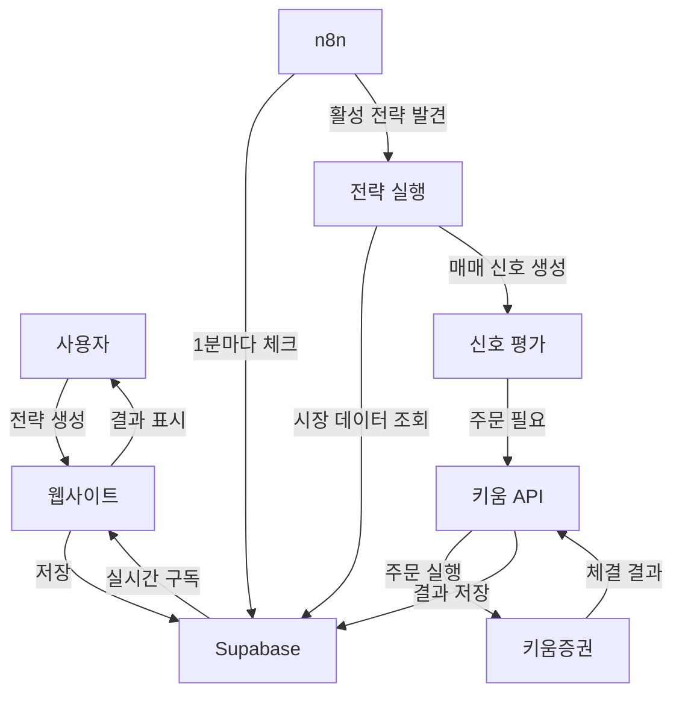

# 📊 자동매매 시스템 아키텍처

## 🎯 시스템 개요

완전 자동화된 주식 매매 시스템으로, 사용자는 웹사이트에서 전략을 생성하면 n8n이 자동으로 실행하고 결과를 확인할 수 있습니다.

## 🏗️ 시스템 구성 요소

### 1. **웹사이트 (React + TypeScript)**
- **역할**: 사용자 인터페이스
- **기능**:
  - 전략 생성/수정/삭제
  - 매매 결과 조회
  - 포트폴리오 현황 확인
  - 성과 분석 차트
- **통신**: Supabase와만 통신 (읽기/쓰기)

### 2. **Supabase (PostgreSQL)**
- **역할**: 중앙 데이터베이스
- **저장 데이터**:
  - `strategies` - 매매 전략
  - `market_data` - 실시간 시장 데이터
  - `trading_signals` - 매매 신호
  - `kiwoom_orders` - 주문 내역
  - `positions` - 현재 포지션
  - `account_balance` - 계좌 잔고
- **특징**: Real-time 구독으로 실시간 업데이트

### 3. **n8n (NAS에서 실행)**
- **역할**: 자동매매 엔진
- **기능**:
  - Supabase 모니터링 (1분 주기)
  - 전략 조건 평가
  - 매매 신호 생성
  - 키움 API 호출
  - 결과 저장
- **독립성**: 웹사이트와 독립적으로 동작

### 4. **키움 OpenAPI (로컬 PC)**
- **역할**: 실제 주문 실행
- **기능**:
  - 실시간 시세 수신
  - 매수/매도 주문
  - 계좌 정보 조회
  - 체결 내역 확인

## 📈 데이터 흐름



## 🔄 상세 프로세스

### Phase 1: 전략 생성
1. **사용자 액션**: 웹사이트에서 전략 생성
2. **데이터 저장**: 
   ```javascript
   {
     name: "RSI 과매도 전략",
     is_active: true,
     config: {
       indicators: { rsi: { enabled: true, period: 14 } },
       entry_conditions: { rsi: "oversold" },
       risk_management: { stop_loss: 3, take_profit: 5 }
     }
   }
   ```
3. **상태**: Supabase `strategies` 테이블에 저장

### Phase 2: n8n 모니터링
1. **스케줄**: 1분마다 실행
2. **조회**: 
   ```sql
   SELECT * FROM strategies WHERE is_active = true
   ```
3. **평가**: 각 전략의 실행 조건 확인
   - 장 시간 체크 (09:00 ~ 15:30)
   - 마지막 실행 시간 확인
   - 전략 조건 평가

### Phase 3: 신호 생성
1. **시장 데이터 조회**: 대상 종목의 현재가, 기술적 지표
2. **조건 매칭**:
   - RSI < 30 → 매수 신호
   - RSI > 70 → 매도 신호
   - MACD 골든크로스 → 매수 신호
3. **신호 저장**: `trading_signals` 테이블

### Phase 4: 주문 실행
1. **키움 API 호출**:
   ```python
   order = {
     "stock_code": "005930",
     "order_type": "BUY",
     "quantity": 10,
     "price": 70000
   }
   ```
2. **주문 전송**: 키움증권 서버로 전송
3. **체결 대기**: 주문 상태 모니터링

### Phase 5: 결과 저장
1. **체결 정보**: `kiwoom_orders` 테이블
2. **포지션 업데이트**: `positions` 테이블
3. **계좌 잔고**: `account_balance` 테이블
4. **실행 로그**: `strategy_execution_logs` 테이블

### Phase 6: 결과 표시
1. **실시간 구독**:
   ```javascript
   supabase
     .from('positions')
     .on('*', handlePositionChange)
     .subscribe()
   ```
2. **UI 업데이트**: 
   - 현재 포지션
   - 손익 현황
   - 매매 내역

## 🚀 시작하는 방법

### 1. Supabase 설정
- 데이터베이스 테이블 생성 (완료)
- RLS 정책 설정 (완료)

### 2. n8n 설정 (NAS)
```bash
# n8n 환경변수
SUPABASE_URL=https://hznkyaomtrpzcayayayh.supabase.co
SUPABASE_ANON_KEY=eyJhbGci...
KIWOOM_API_URL=http://[로컬PC-IP]:8000
```

### 3. 키움 API 서버 (로컬 PC)
```bash
cd backend
python scripts/kiwoom/kiwoom_bridge_server.py
```

### 4. 웹사이트 실행
```bash
npm run dev
# http://localhost:3000
```

### 5. 워크플로우 활성화
- n8n 웹 UI 접속: `http://[NAS-IP]:5678`
- `supabase-monitoring-workflow.json` 임포트
- 워크플로우 활성화

## 📊 모니터링

### 실시간 확인 가능한 항목
- **포트폴리오**: 총 자산, 수익률, 보유 종목
- **매매 내역**: 체결 시간, 종목, 수량, 가격
- **전략 성과**: 승률, 평균 수익, 최대 손실
- **시스템 상태**: n8n 실행 상태, API 연결 상태

### 로그 위치
- **n8n 로그**: NAS의 n8n 콘솔
- **키움 API 로그**: `backend/logs/kiwoom.log`
- **전략 실행 로그**: Supabase `strategy_execution_logs` 테이블

## 🔐 보안

### 데이터 보호
- Supabase RLS로 사용자별 데이터 격리
- API 키는 환경변수로 관리
- 키움 인증서는 로컬에만 저장

### 리스크 관리
- 포지션 크기 제한
- 일일 최대 거래 횟수 제한
- 손절/익절 자동 실행

## 🎯 핵심 포인트

1. **웹사이트는 UI만**: 전략 생성과 결과 확인만 담당
2. **n8n이 두뇌**: 모든 자동매매 로직 실행
3. **Supabase가 중심**: 모든 데이터의 허브
4. **키움 API가 손발**: 실제 매매 실행

이 구조의 장점:
- ✅ 각 컴포넌트가 독립적
- ✅ 웹사이트 다운되어도 자동매매 계속 실행
- ✅ n8n 재시작해도 전략 유지
- ✅ 실시간 모니터링 가능