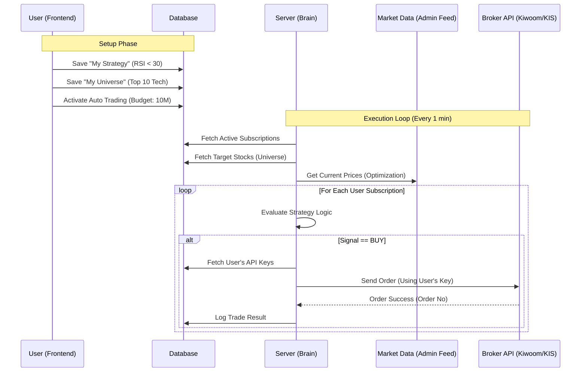

# Non-Admin User Execution Process Flow

This document details how a standard user's interaction with the Strategy Builder and Universe Builder translates into automated trading execution on the backend.

## 1. The User Workflow (Frontend)

### Phase 1: Creation (My Strategy & My Universe)
1.  **Strategy Builder**:
    *   User designs logic (e.g., "RSI < 30").
    *   **Save**: Stored in `strategies` table with `user_id`. (Private to user).
2.  **Universe Builder**:
    *   User selects stocks (e.g., "KOSPI Top 50" or "Semiconductor Sector").
    *   **Save**: Stored in `investment_universes` table with `user_id`. (Private to user).
    *   *Note*: The "Universe" is a dynamic or static list of stock codes.

### Phase 2: Activation (Auto Trading Tab)
1.  **Selection**: User sees *only their* Strategies and Universes.
2.  **Configuration**:
    *   Selects "My RSI Strategy".
    *   Selects "My Tech Stocks Universe".
    *   Sets **Allocated Capital** (e.g., 10,000,000 KRW).
    *   Sets **Max Stocks** (e.g., 5).
3.  **Action**: Clicks "Start Trading".
4.  **System Entry**:
    *   Inserts a record into `active_strategies` (or `strategy_subscriptions`).
    *   Data: `{ user_id, strategy_id, universe_id, allocated_capital, status: 'RUNNING' }`.

---

## 2. The Backend Process (Server Loop)

The Server runs a continuous loop (scheduled via Cron/APScheduler) to process these user intentions.

### Step 1: Context Loading & Grouping
The scheduler wakes up (e.g., every minute or on real-time tick).
1.  **Fetch Subscriptions**: Query `active_strategies` where `status = 'RUNNING'`.
2.  **Group by Universe** (Optimization):
    *   If User A and User B both watch "Samsung Electronics", fetch its price *once* using the **Admin's Market Data Feed**.
    *   *Result*: A cache of latest market data for all tickers required by all active users.

### Step 2: Evaluation (The Brain)
Iterate through each **Active Subscription**:
1.  **Load Context**:
    *   Fetch User's Strategy Logic (`strategies` table).
    *   Fetch User's Universe List (`investment_universes`).
2.  **Run Logic**:
    *   For each stock in the Universe:
        *   Apply Strategy Logic against cached Market Data.
        *   *Example*: "Samsung RSI is 25 (Condition < 30) -> **SIGNAL: BUY**".

### Step 3: Risk Management & Filtering
Before executing `BUY`, checks:
1.  **Budget Check**: User's `Allocated Capital` vs Current Usage.
2.  **Slot Check**: User's `Max Stocks` limit (e.g., already holding 5 stocks? Skip).
3.  **Duplicate Check**: Already holding this stock? (Skip or Add more based on settings).

### Step 4: Execution (The Hand)
If the Signal passes all checks:
1.  **Credential Retrieval**:
    *   Look up `user_api_keys` for this `user_id`.
    *   Decrypt `AppKey`, `Secret`, `Account No`.
2.  **Client Instantiation**:
    *   Create a temporary `KiwoomAPIClient` using *this specific user's credentials*.
3.  **Order Generation**:
    *   Calculate Quantity (based on Price and Budget).
    *   **Send API Request**: `POST /api/dostk/ordr` (Simulating the User).
    *   *Note*: This request goes to the Broker API causing the trade to happen on the **User's Real Account**.

### Step 5: Logging & Notification
1.  **DB Log**: Insert into `trade_logs` (linked to `user_id`).
2.  **UI Update**: User sees a new notification: "Buy Order Executed: Samsung Electronics".
3.  **Portfolio Update**: Next sync cycle updates the user's `portfolio` table.

---

## Process Diagram

