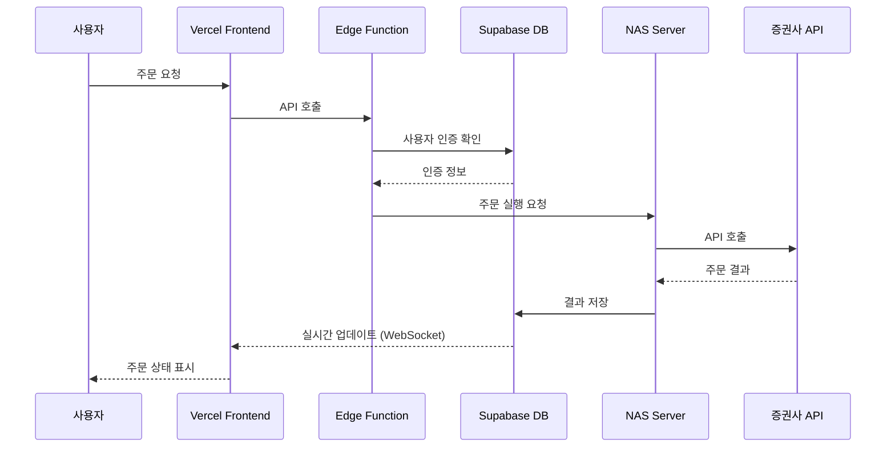
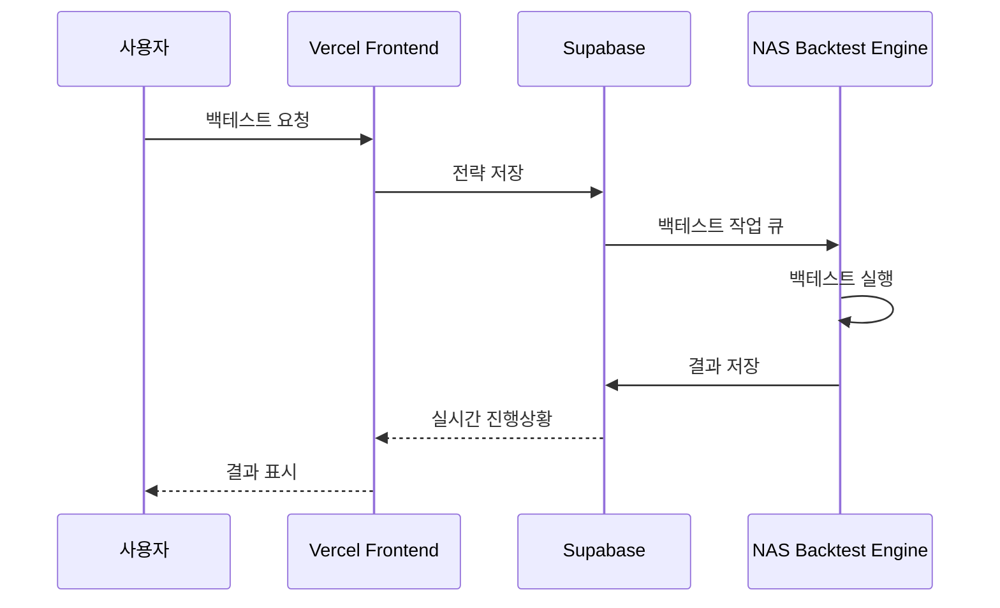

# Supabase + Vercel + NAS 기반 다중 사용자 투자 플랫폼 아키텍처

## 📋 현재 시스템 분석

### 현재 기술 스택
- **Frontend**: React + TypeScript + Vite
- **Styling**: MUI + Tailwind CSS
- **State**: Redux Toolkit
- **Backend Database**: Supabase (PostgreSQL)
- **Deployment**: Vercel
- **Local Backend**: Python (백테스트, 키움 API 연동)
- **Real-time**: Supabase Realtime + Socket.io

### 현재 Supabase 활용 현황
```typescript
// 현재 구현된 주요 테이블
- users: 사용자 관리
- strategies: 전략 저장
- portfolio: 포트폴리오
- orders: 주문 내역
- price_data: 가격 데이터
- backtest_results: 백테스트 결과
- trading_signals: 거래 신호
```

---

## 🏗️ 제안하는 하이브리드 아키텍처

### 전체 시스템 구조
```
┌─────────────────────────────────────────────────────────┐
│                   사용자 접속 Layer                       │
│  ┌────────────┐  ┌────────────┐  ┌────────────┐       │
│  │    Web     │  │   Mobile   │  │    PWA     │       │
│  │  (Vercel)  │  │   (App)    │  │ (Offline)  │       │
│  └────────────┘  └────────────┘  └────────────┘       │
└─────────────────────────────────────────────────────────┘
                            ↓
┌─────────────────────────────────────────────────────────┐
│                    Vercel Edge Functions                 │
│  ┌──────────────────────────────────────────┐          │
│  │  - API Routes (/api/*)                   │          │
│  │  - Authentication Middleware              │          │
│  │  - Rate Limiting                         │          │
│  │  - Caching Layer                         │          │
│  └──────────────────────────────────────────┘          │
└─────────────────────────────────────────────────────────┘
                            ↓
┌─────────────────────────────────────────────────────────┐
│                      Supabase Cloud                      │
│  ┌────────────┐  ┌────────────┐  ┌────────────┐       │
│  │ PostgreSQL │  │  Realtime  │  │   Auth     │       │
│  │  Database  │  │  (WebSocket)│  │  (JWT)     │       │
│  └────────────┘  └────────────┘  └────────────┘       │
│  ┌────────────┐  ┌────────────┐  ┌────────────┐       │
│  │  Storage   │  │   Vector   │  │   Edge     │       │
│  │  (Files)   │  │    (AI)    │  │ Functions  │       │
│  └────────────┘  └────────────┘  └────────────┘       │
└─────────────────────────────────────────────────────────┘
                            ↓
┌─────────────────────────────────────────────────────────┐
│              Synology NAS (Heavy Computing)              │
│  ┌──────────────────────────────────────────┐          │
│  │         Docker Container Services         │          │
│  │  ┌──────────┐  ┌──────────┐  ┌─────────┐│          │
│  │  │ Backtest │  │  Market  │  │Strategy ││          │
│  │  │  Engine  │  │ Collector│  │ Executor││          │
│  │  └──────────┘  └──────────┘  └─────────┘│          │
│  │  ┌──────────┐  ┌──────────┐  ┌─────────┐│          │
│  │  │  KIS API │  │  eBEST   │  │LS API  ││          │
│  │  │  Bridge  │  │   API    │  │ Bridge  ││          │
│  │  └──────────┘  └──────────┘  └─────────┘│          │
│  └──────────────────────────────────────────┘          │
└─────────────────────────────────────────────────────────┘
```

---

## 🔧 핵심 기능별 구현 전략

### 1. Supabase 최대 활용 방안

#### 1.1 Authentication & Authorization
```typescript
// Supabase Auth + RLS (Row Level Security)
// supabase/migrations/auth_policies.sql

-- 사용자별 데이터 접근 정책
CREATE POLICY "Users can only see own data" ON strategies
  FOR ALL USING (auth.uid() = user_id);

-- 프리미엄 사용자 기능
CREATE POLICY "Premium users can access advanced features" ON advanced_strategies
  FOR SELECT USING (
    EXISTS (
      SELECT 1 FROM user_subscriptions
      WHERE user_id = auth.uid()
      AND plan = 'premium'
      AND expires_at > NOW()
    )
  );

-- API 호출 제한
CREATE OR REPLACE FUNCTION check_api_limit()
RETURNS TRIGGER AS $$
BEGIN
  IF (
    SELECT COUNT(*) FROM api_calls
    WHERE user_id = NEW.user_id
    AND created_at > NOW() - INTERVAL '1 hour'
  ) >= 100 THEN
    RAISE EXCEPTION 'API rate limit exceeded';
  END IF;
  RETURN NEW;
END;
$$ LANGUAGE plpgsql;
```

#### 1.2 Realtime Subscriptions
```typescript
// Frontend: React Hook for Realtime Data
import { useEffect, useState } from 'react'
import { supabase } from '@/lib/supabase'

export function useRealtimePrice(stockCode: string) {
  const [price, setPrice] = useState(null)
  
  useEffect(() => {
    // 실시간 가격 구독
    const channel = supabase
      .channel(`price:${stockCode}`)
      .on('postgres_changes', 
        { 
          event: '*', 
          schema: 'public', 
          table: 'realtime_prices',
          filter: `stock_code=eq.${stockCode}`
        },
        (payload) => {
          setPrice(payload.new)
        }
      )
      .subscribe()
    
    return () => {
      supabase.removeChannel(channel)
    }
  }, [stockCode])
  
  return price
}

// 다중 사용자 실시간 주문 상태
export function useOrderStatus(userId: string) {
  const [orders, setOrders] = useState([])
  
  useEffect(() => {
    const channel = supabase
      .channel(`orders:${userId}`)
      .on('postgres_changes',
        {
          event: 'UPDATE',
          schema: 'public',
          table: 'orders',
          filter: `user_id=eq.${userId}`
        },
        (payload) => {
          setOrders(prev => 
            prev.map(order => 
              order.id === payload.new.id ? payload.new : order
            )
          )
        }
      )
      .subscribe()
    
    return () => {
      supabase.removeChannel(channel)
    }
  }, [userId])
  
  return orders
}
```

#### 1.3 Edge Functions (Supabase Functions)
```typescript
// supabase/functions/execute-trade/index.ts
import { serve } from 'https://deno.land/std@0.168.0/http/server.ts'
import { createClient } from 'https://esm.sh/@supabase/supabase-js@2'

serve(async (req) => {
  const { stockCode, quantity, orderType, userId } = await req.json()
  
  // Supabase 클라이언트
  const supabase = createClient(
    Deno.env.get('SUPABASE_URL')!,
    Deno.env.get('SUPABASE_SERVICE_ROLE_KEY')!
  )
  
  // 사용자 API 키 조회
  const { data: credentials } = await supabase
    .from('user_api_credentials')
    .select('*')
    .eq('user_id', userId)
    .single()
  
  // NAS 서버로 주문 전송
  const response = await fetch(`${Deno.env.get('NAS_API_URL')}/execute-order`, {
    method: 'POST',
    headers: {
      'Content-Type': 'application/json',
      'X-API-Key': Deno.env.get('NAS_API_KEY')!
    },
    body: JSON.stringify({
      broker: credentials.broker_type,
      apiKey: credentials.encrypted_api_key,
      stockCode,
      quantity,
      orderType
    })
  })
  
  const result = await response.json()
  
  // 주문 결과 저장
  await supabase
    .from('orders')
    .insert({
      user_id: userId,
      stock_code: stockCode,
      quantity,
      order_type: orderType,
      status: result.status,
      broker_order_id: result.orderId
    })
  
  return new Response(JSON.stringify(result), {
    headers: { 'Content-Type': 'application/json' }
  })
})
```

#### 1.4 Storage for Files
```typescript
// 백테스트 결과 파일 저장
export async function saveBacktestReport(userId: string, report: Blob) {
  const fileName = `backtest_${userId}_${Date.now()}.pdf`
  
  const { data, error } = await supabase.storage
    .from('backtest-reports')
    .upload(fileName, report, {
      contentType: 'application/pdf',
      upsert: false
    })
  
  if (error) throw error
  
  // 공유 가능한 URL 생성
  const { data: { publicUrl } } = supabase.storage
    .from('backtest-reports')
    .getPublicUrl(fileName)
  
  return publicUrl
}
```

### 2. Vercel 활용 전략

#### 2.1 API Routes
```typescript
// app/api/strategy/execute/route.ts
import { NextRequest, NextResponse } from 'next/server'
import { createClient } from '@supabase/supabase-js'
import { verifyJWT } from '@/lib/auth'

export async function POST(request: NextRequest) {
  // JWT 검증
  const token = request.headers.get('authorization')?.replace('Bearer ', '')
  const user = await verifyJWT(token)
  
  if (!user) {
    return NextResponse.json({ error: 'Unauthorized' }, { status: 401 })
  }
  
  // Rate limiting check
  const rateLimit = await checkRateLimit(user.id)
  if (!rateLimit.allowed) {
    return NextResponse.json(
      { error: 'Rate limit exceeded' }, 
      { status: 429 }
    )
  }
  
  const { strategyId, stockCode } = await request.json()
  
  // Supabase에서 전략 조회
  const supabase = createClient(
    process.env.NEXT_PUBLIC_SUPABASE_URL!,
    process.env.SUPABASE_SERVICE_ROLE_KEY!
  )
  
  const { data: strategy } = await supabase
    .from('strategies')
    .select('*')
    .eq('id', strategyId)
    .eq('user_id', user.id)
    .single()
  
  // NAS 서버로 전략 실행 요청
  const nasResponse = await fetch(`${process.env.NAS_API_URL}/strategy/execute`, {
    method: 'POST',
    headers: {
      'Content-Type': 'application/json',
      'X-API-Key': process.env.NAS_API_KEY!
    },
    body: JSON.stringify({
      strategy,
      stockCode,
      userId: user.id
    })
  })
  
  const result = await nasResponse.json()
  
  return NextResponse.json(result)
}
```

#### 2.2 Edge Middleware
```typescript
// middleware.ts
import { NextResponse } from 'next/server'
import type { NextRequest } from 'next/server'
import { jwtVerify } from 'jose'

export async function middleware(request: NextRequest) {
  // API 경로 보호
  if (request.nextUrl.pathname.startsWith('/api/')) {
    const token = request.cookies.get('auth-token')?.value
    
    if (!token) {
      return NextResponse.json(
        { error: 'Authentication required' },
        { status: 401 }
      )
    }
    
    try {
      const secret = new TextEncoder().encode(process.env.JWT_SECRET!)
      await jwtVerify(token, secret)
    } catch {
      return NextResponse.json(
        { error: 'Invalid token' },
        { status: 401 }
      )
    }
  }
  
  // 지역별 라우팅
  const country = request.geo?.country || 'KR'
  if (country !== 'KR' && request.nextUrl.pathname.startsWith('/trading')) {
    return NextResponse.redirect(new URL('/restricted', request.url))
  }
  
  return NextResponse.next()
}

export const config = {
  matcher: ['/api/:path*', '/trading/:path*']
}
```

### 3. NAS 서버 구성

#### 3.1 Docker Compose 설정
```yaml
# docker-compose.yml
version: '3.8'

services:
  # FastAPI 메인 서버
  api-server:
    build: ./services/api
    ports:
      - "8000:8000"
    environment:
      - SUPABASE_URL=${SUPABASE_URL}
      - SUPABASE_SERVICE_KEY=${SUPABASE_SERVICE_KEY}
      - REDIS_URL=redis://redis:6379
    volumes:
      - ./data:/app/data
    depends_on:
      - redis
      - postgres-local

  # 백테스트 엔진
  backtest-engine:
    build: ./services/backtest
    environment:
      - SUPABASE_URL=${SUPABASE_URL}
      - SUPABASE_SERVICE_KEY=${SUPABASE_SERVICE_KEY}
    volumes:
      - ./strategies:/app/strategies
      - ./market-data:/app/market-data
    deploy:
      replicas: 3  # 병렬 처리를 위한 복수 인스턴스

  # 실시간 데이터 수집기
  market-collector:
    build: ./services/collector
    environment:
      - KIS_APP_KEY=${KIS_APP_KEY}
      - KIS_APP_SECRET=${KIS_APP_SECRET}
      - EBEST_ID=${EBEST_ID}
      - EBEST_PW=${EBEST_PW}
    volumes:
      - ./market-data:/app/data
    restart: always

  # 전략 실행 워커
  strategy-worker:
    build: ./services/worker
    environment:
      - CELERY_BROKER=redis://redis:6379
      - CELERY_BACKEND=redis://redis:6379
    depends_on:
      - redis
    deploy:
      replicas: 5

  # Redis (캐시 & 메시지 큐)
  redis:
    image: redis:7-alpine
    volumes:
      - redis-data:/data
    ports:
      - "6379:6379"

  # 로컬 PostgreSQL (고속 처리용)
  postgres-local:
    image: timescale/timescaledb:latest-pg14
    environment:
      - POSTGRES_PASSWORD=${LOCAL_DB_PASSWORD}
    volumes:
      - postgres-data:/var/lib/postgresql/data
    ports:
      - "5432:5432"

  # Nginx (리버스 프록시)
  nginx:
    image: nginx:alpine
    ports:
      - "80:80"
      - "443:443"
    volumes:
      - ./nginx.conf:/etc/nginx/nginx.conf
      - ./ssl:/etc/nginx/ssl
    depends_on:
      - api-server

volumes:
  redis-data:
  postgres-data:
```

#### 3.2 증권사 API 브릿지
```python
# services/api/brokers/kis_broker.py
from typing import Dict, Any
import aiohttp
import asyncio
from cryptography.fernet import Fernet

class KISBroker:
    """한국투자증권 API 브릿지"""
    
    def __init__(self, encrypted_credentials: str):
        # 암호화된 인증정보 복호화
        cipher = Fernet(os.environ['ENCRYPTION_KEY'])
        credentials = json.loads(
            cipher.decrypt(encrypted_credentials.encode()).decode()
        )
        
        self.app_key = credentials['app_key']
        self.app_secret = credentials['app_secret']
        self.account = credentials['account']
        self.base_url = "https://openapi.koreainvestment.com:9443"
        
    async def place_order(self, order: Dict[str, Any]) -> Dict[str, Any]:
        """주문 실행"""
        # 토큰 발급
        token = await self._get_access_token()
        
        headers = {
            "authorization": f"Bearer {token}",
            "appkey": self.app_key,
            "appsecret": self.app_secret,
            "tr_id": "TTTC0802U"  # 매수 주문
        }
        
        body = {
            "CANO": self.account[:8],
            "ACNT_PRDT_CD": self.account[8:],
            "PDNO": order['stock_code'],
            "ORD_DVSN": "01",  # 지정가
            "ORD_QTY": str(order['quantity']),
            "ORD_UNPR": str(order['price'])
        }
        
        async with aiohttp.ClientSession() as session:
            async with session.post(
                f"{self.base_url}/uapi/domestic-stock/v1/trading/order-cash",
                headers=headers,
                json=body
            ) as response:
                result = await response.json()
                
                # Supabase에 결과 저장
                await self.save_order_result(order['user_id'], result)
                
                return result
    
    async def get_balance(self) -> Dict[str, Any]:
        """계좌 잔고 조회"""
        token = await self._get_access_token()
        
        headers = {
            "authorization": f"Bearer {token}",
            "appkey": self.app_key,
            "appsecret": self.app_secret,
            "tr_id": "TTTC8434R"
        }
        
        params = {
            "CANO": self.account[:8],
            "ACNT_PRDT_CD": self.account[8:],
            "AFHR_FLPR_YN": "N",
            "OFL_YN": "N",
            "INQR_DVSN": "02",
            "UNPR_DVSN": "01",
            "FUND_STTL_ICLD_YN": "N",
            "FNCG_AMT_AUTO_RDPT_YN": "N",
            "PRCS_DVSN": "01",
            "CTX_AREA_FK100": "",
            "CTX_AREA_NK100": ""
        }
        
        async with aiohttp.ClientSession() as session:
            async with session.get(
                f"{self.base_url}/uapi/domestic-stock/v1/trading/inquire-balance",
                headers=headers,
                params=params
            ) as response:
                return await response.json()
```

#### 3.3 백테스트 엔진
```python
# services/backtest/engine.py
import pandas as pd
import numpy as np
from typing import Dict, List, Any
import asyncio
from supabase import create_client
import json

class BacktestEngine:
    def __init__(self, strategy_config: Dict[str, Any]):
        self.strategy = strategy_config
        self.initial_capital = strategy_config.get('initial_capital', 10000000)
        self.supabase = create_client(
            os.environ['SUPABASE_URL'],
            os.environ['SUPABASE_SERVICE_KEY']
        )
    
    async def run_backtest(
        self, 
        stock_codes: List[str], 
        start_date: str, 
        end_date: str
    ) -> Dict[str, Any]:
        """백테스트 실행"""
        
        # 1. 가격 데이터 로드
        price_data = await self.load_price_data(stock_codes, start_date, end_date)
        
        # 2. 지표 계산
        indicators = self.calculate_indicators(price_data)
        
        # 3. 신호 생성
        signals = self.generate_signals(indicators)
        
        # 4. 포트폴리오 시뮬레이션
        portfolio = self.simulate_portfolio(signals, price_data)
        
        # 5. 성과 분석
        performance = self.analyze_performance(portfolio)
        
        # 6. 결과 저장
        await self.save_results(performance)
        
        return performance
    
    async def load_price_data(
        self, 
        stock_codes: List[str], 
        start_date: str, 
        end_date: str
    ) -> pd.DataFrame:
        """Supabase에서 가격 데이터 로드"""
        
        # 대량 데이터는 로컬 DB 캐시 활용
        local_data = await self.check_local_cache(stock_codes, start_date, end_date)
        
        if local_data is not None:
            return local_data
        
        # Supabase에서 조회
        data = []
        for code in stock_codes:
            response = self.supabase.table('price_data') \
                .select('*') \
                .eq('stock_code', code) \
                .gte('date', start_date) \
                .lte('date', end_date) \
                .execute()
            
            data.extend(response.data)
        
        df = pd.DataFrame(data)
        
        # 로컬 캐시에 저장
        await self.save_local_cache(df)
        
        return df
    
    def calculate_indicators(self, price_data: pd.DataFrame) -> pd.DataFrame:
        """기술적 지표 계산"""
        df = price_data.copy()
        
        # 이동평균
        for period in [5, 20, 60, 120]:
            df[f'MA_{period}'] = df.groupby('stock_code')['close'].transform(
                lambda x: x.rolling(window=period).mean()
            )
        
        # RSI
        df['RSI'] = df.groupby('stock_code')['close'].transform(
            lambda x: self.calculate_rsi(x, 14)
        )
        
        # 볼린저 밴드
        df['BB_upper'], df['BB_middle'], df['BB_lower'] = \
            df.groupby('stock_code')['close'].transform(
                lambda x: self.calculate_bollinger_bands(x, 20, 2)
            ).values.T
        
        return df
    
    def generate_signals(self, indicators: pd.DataFrame) -> pd.DataFrame:
        """매매 신호 생성"""
        df = indicators.copy()
        
        # 전략에 따른 신호 생성
        buy_conditions = self.strategy.get('buy_conditions', [])
        sell_conditions = self.strategy.get('sell_conditions', [])
        
        df['buy_signal'] = False
        df['sell_signal'] = False
        
        for condition in buy_conditions:
            df['buy_signal'] |= self.evaluate_condition(df, condition)
        
        for condition in sell_conditions:
            df['sell_signal'] |= self.evaluate_condition(df, condition)
        
        return df
    
    async def save_results(self, performance: Dict[str, Any]) -> None:
        """백테스트 결과 Supabase 저장"""
        
        result = {
            'strategy_id': self.strategy['id'],
            'user_id': self.strategy['user_id'],
            'start_date': self.strategy['start_date'],
            'end_date': self.strategy['end_date'],
            'initial_capital': self.initial_capital,
            'final_capital': performance['final_capital'],
            'total_return': performance['total_return'],
            'sharpe_ratio': performance['sharpe_ratio'],
            'max_drawdown': performance['max_drawdown'],
            'win_rate': performance['win_rate'],
            'total_trades': performance['total_trades'],
            'results_data': json.dumps(performance)
        }
        
        response = self.supabase.table('backtest_results').insert(result).execute()
        
        # 실시간 알림
        await self.notify_user(self.strategy['user_id'], result)
```

---

## 📊 데이터 플로우

### 1. 실시간 거래 플로우


### 2. 백테스트 플로우


---

## 🔐 보안 및 권한 관리

### 1. 다중 계층 보안
```typescript
// Supabase RLS 정책
-- 개인 데이터 보호
ALTER TABLE strategies ENABLE ROW LEVEL SECURITY;

CREATE POLICY "Users can CRUD own strategies" ON strategies
  USING (auth.uid() = user_id);

-- 공유 전략
CREATE POLICY "Public strategies are readable" ON strategies
  FOR SELECT
  USING (is_public = true);

-- 실전 거래 권한
CREATE TABLE trading_permissions (
  user_id UUID PRIMARY KEY,
  can_paper_trade BOOLEAN DEFAULT true,
  can_real_trade BOOLEAN DEFAULT false,
  daily_trade_limit INTEGER DEFAULT 10,
  max_position_size DECIMAL DEFAULT 1000000,
  verified_at TIMESTAMP
);

CREATE POLICY "Only verified users can real trade" ON orders
  FOR INSERT
  WITH CHECK (
    EXISTS (
      SELECT 1 FROM trading_permissions
      WHERE user_id = auth.uid()
      AND can_real_trade = true
      AND verified_at IS NOT NULL
    )
  );
```

### 2. API 보안
```typescript
// Vercel API Route 보안
export async function middleware(request: NextRequest) {
  // IP 화이트리스트
  const allowedIPs = process.env.ALLOWED_IPS?.split(',') || []
  const clientIP = request.headers.get('x-forwarded-for') || ''
  
  if (allowedIPs.length > 0 && !allowedIPs.includes(clientIP)) {
    return NextResponse.json(
      { error: 'Access denied' },
      { status: 403 }
    )
  }
  
  // Rate limiting
  const identifier = clientIP || request.headers.get('x-user-id') || 'anonymous'
  const { success, limit, reset, remaining } = await ratelimit.limit(identifier)
  
  if (!success) {
    return NextResponse.json(
      { error: 'Too many requests' },
      { status: 429, headers: {
        'X-RateLimit-Limit': limit.toString(),
        'X-RateLimit-Remaining': remaining.toString(),
        'X-RateLimit-Reset': new Date(reset).toISOString()
      }}
    )
  }
  
  return NextResponse.next()
}
```

---

## 🚀 구현 로드맵

### Phase 1: 기반 구축 (2주)
- [ ] Supabase 스키마 재설계 (다중 사용자)
- [ ] RLS 정책 설정
- [ ] Vercel 프로젝트 설정
- [ ] NAS Docker 환경 구성

### Phase 2: 인증 시스템 (1주)
- [ ] Supabase Auth 설정
- [ ] OAuth 소셜 로그인
- [ ] 사용자 권한 관리
- [ ] 2FA 구현

### Phase 3: API 개발 (3주)
- [ ] Vercel API Routes
- [ ] Edge Functions
- [ ] NAS REST API
- [ ] WebSocket 연동

### Phase 4: 브로커 통합 (2주)
- [ ] KIS API 브릿지
- [ ] eBEST API 브릿지
- [ ] LS증권 API 브릿지
- [ ] 암호화 처리

### Phase 5: 백테스트 시스템 (2주)
- [ ] 분산 백테스트 엔진
- [ ] 결과 시각화
- [ ] 실시간 진행상황
- [ ] 성과 분석

### Phase 6: 실전 거래 (2주)
- [ ] 실시간 주문 처리
- [ ] 포지션 관리
- [ ] 리스크 관리
- [ ] 알림 시스템

### Phase 7: 최적화 (1주)
- [ ] 성능 튜닝
- [ ] 캐싱 전략
- [ ] 모니터링 설정
- [ ] 부하 테스트

---

## 📈 성공 지표

### 기술 지표
- Vercel 응답시간: <100ms (Edge)
- Supabase 쿼리: <50ms
- NAS 백테스트: <5초 (1년 데이터)
- 동시 접속: 1,000명+

### 비즈니스 지표
- MAU: 1,000명+
- 유료 전환율: 10%+
- 일일 백테스트: 10,000건+
- 월 거래량: 100억원+

---

## 💡 핵심 장점

1. **Supabase 활용**
   - 관리형 DB (운영 부담 감소)
   - 내장 인증/권한 시스템
   - 실시간 구독 기능
   - 자동 백업

2. **Vercel 활용**
   - 글로벌 CDN
   - 자동 스케일링
   - Edge Functions
   - 무료 티어 제공

3. **NAS 활용**
   - 무거운 연산 처리
   - 24/7 운영
   - 프라이빗 데이터
   - 비용 효율성

이 하이브리드 접근법으로 각 플랫폼의 장점을 최대한 활용하면서 확장 가능한 시스템을 구축할 수 있습니다.