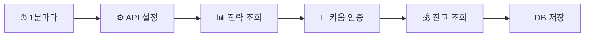

# n8n 워크플로우 설정 가이드

## 🚀 빠른 시작 (권장)

### 1. n8n 접속
- 외부: https://workflow.bll-pro.com
- 내부: http://192.168.50.150:5678

### 2. 워크플로우 임포트
1. **Workflows** → **Import from File**
2. `simplest-workflow.json` 파일 선택
3. Import 클릭

### 3. API 키 설정
1. **"⚙️ API 키 설정"** 노드 더블클릭
2. 다음 값들이 올바른지 확인:
   ```
   SUPABASE_URL: https://hznkyaomtrpzcayayayh.supabase.co
   SUPABASE_KEY: eyJhbGciOiJIUzI1NiIsInR5cCI6IkpXVCJ9...
   KIWOOM_APP_KEY: iQ4uqUvLr7IAXTnOv1a7_156IHhIu9l8aiXiBDbSsSk
   KIWOOM_APP_SECRET: 9uBOq4tEp_DQO1-L6jBiGrFVD7yr-FeSZRQXFd2wmUA
   KIWOOM_ACCOUNT: 81101350-01
   ```

### 4. 테스트 실행
1. **Execute Workflow** 버튼 클릭
2. 각 노드에 녹색 체크 표시 확인
3. 에러 발생시 빨간 노드 클릭하여 상세 확인

### 5. 자동 실행 활성화
1. 우측 상단 **Inactive** → **Active** 토글
2. **Save** 클릭

## 📊 워크플로우 동작 흐름



## ✅ 확인사항

### Supabase에서 데이터 확인
1. https://supabase.com/dashboard/project/hznkyaomtrpzcayayayh
2. Table Editor 접속
3. 다음 테이블 확인:
   - `strategies` - 전략 목록
   - `account_balance` - 계좌 잔고
   - `trading_signals` - 매매 신호
   - `kiwoom_orders` - 주문 내역

### n8n에서 실행 기록 확인
1. n8n → **Executions** 탭
2. 성공/실패 기록 확인
3. 실패시 상세 에러 메시지 확인

## 🔧 문제 해결

### "401 Unauthorized" 에러
- API 키가 올바른지 확인
- Supabase 키 만료 여부 확인

### "Connection refused" 에러
- 키움 API 서버 상태 확인
- 네트워크 연결 확인

### 데이터가 저장되지 않음
- Supabase RLS 정책 확인
- 테이블 권한 설정 확인

## 📝 참고사항

- 워크플로우는 1분마다 자동 실행됩니다
- 모든 API 키는 Set 노드에서 중앙 관리됩니다
- 수정이 필요한 경우 Set 노드만 편집하면 됩니다
- OAuth2 Credential 설정은 불필요합니다